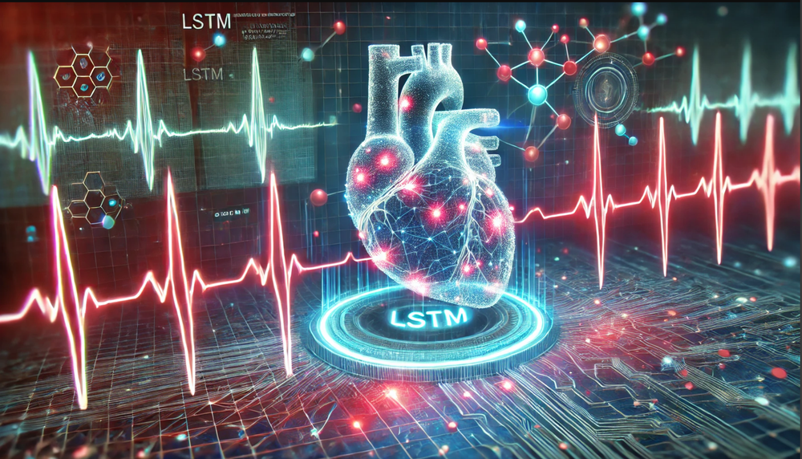
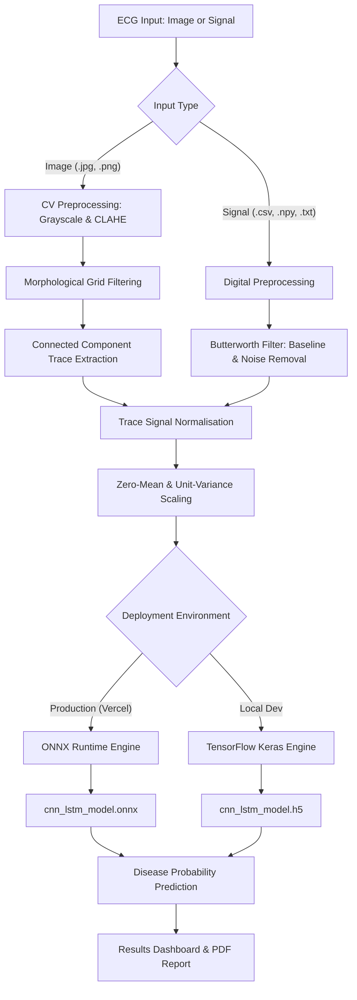

# CardioDetect: ECG Cardiovascular Disease Detection using CNN-LSTM

<p align="center">
  
</p>

<p align="center">
  <strong>An AI-powered web platform for detecting cardiovascular diseases from digital ECG signals and paper ECG recordings.</strong>
</p>

<p align="center">
  
  
  
  
  
</p>

<p align="center">
  
</p>

---

## 🏥 Project Overview

CardioDetect is an intelligent system designed to assist healthcare professionals and individuals in identifying cardiovascular abnormalities. It leverages a hybrid **CNN-LSTM (Convolutional Neural Network and Long Short-Term Memory)** deep learning architecture to analyze two distinct types of ECG inputs:

1. **Digital ECG Signals**: Raw signal data in format of NumPy arrays, CSV tables, or structured text.
2. **Paper/Image ECG Recordings**: Captured images of printed ECG traces (from screenshots, scanners, or mobile cameras) processed via computer vision.

The project is optimized for high-performance serverless deployment on **Vercel** utilizing **ONNX Runtime** to bypass the package size limitations of standard deep learning frameworks.

---

## ✨ Key Features

- 📈 **Multi-Format Input**: Upload and analyze ECG data in PNG, JPG, JPEG, CSV, TXT, and NPY formats.
- 👁️ **Computer Vision Extraction**: Advanced image-processing pipeline (CLAHE, Adaptive Thresholding, Connected Component Analysis) that extracts clean digital traces from paper ECG prints.
- ⚡ **Dual Inference Engine**: Dynamically executes predictions using ONNX Runtime in production (Vercel) and TensorFlow/Keras in local development.
- 💓 **Unified Heart Rate Engine**: Automatically calculates real-time clinical indices such as average Heart Rate (BPM), Rhythm Regularity, and identifies specific conditions (Bradycardia, Tachycardia, Arrhythmias) on both digital signals and image scans.
- 💖 **Dynamic Beating Heart Icon**: Features an animated dashboard heart widget that beats in exact physiological sync (speed and rhythm) with the patient's detected heart rate.
- 🖨️ **Printable Reports**: Generate print-ready analysis summaries including signal visualisations and disease confidence levels.
- 📊 **Model Training Interface**: Simulated training console to monitor CNN-LSTM network performance (loss and accuracy) across epochs.

---

## 🧠 System & Model Architecture



### 1. The Deep Learning Model
- **Conv1D Layers**: Extract spatial, local morphological features from the raw temporal sequences.
- **Batch Normalisation & Dropout**: Prevent overfitting and stabilise training weight distribution.
- **Bidirectional LSTM Layers**: Capture temporal, time-dependent correlations (forward and backward dependencies) of the ECG signal waves.
- **Dense Classifier**: Output layer mapped through a Sigmoid function for binary risk classification.

---

## 🛠️ Technology Stack

| Component | Technology |
|---|---|
| **Backend Framework** | Flask, Werkzeug |
| **Inference Engines** | ONNX Runtime, TensorFlow (Keras) |
| **Data & Scientific Computation** | NumPy, Pandas, SciPy, Scikit-learn, Joblib |
| **Computer Vision (CV)** | OpenCV Headless (PIL) |
| **Plotting & Visualisation** | Matplotlib, Base64 Streamers |
| **Frontend UI** | HTML5, CSS3, JavaScript, Bootstrap 5, FontAwesome, Animate.css |

---

## 📦 Installation & Local Setup

### Prerequisites
- Python 3.8 to 3.11
- Virtual environment tool (`venv` or `conda`)

### Setup Instructions

1. **Clone the Repository**
   ```bash
   git clone https://github.com/Kaushikkadari/Detection-of-Cardiovascular-Diseases-within-the-ECG-Data-Using-CNN-and-LSTM-.git
   cd Detection-of-Cardiovascular-Diseases-within-the-ECG-Data-Using-CNN-and-LSTM-
   ```

2. **Configure Virtual Environment**
   ```bash
   python -m venv venv
   # On Windows (PowerShell)
   venv\Scripts\Activate.ps1
   # On macOS/Linux
   source venv/bin/activate
   ```

3. **Install Dependencies**
   - **For Development & Model Conversion** (includes full TensorFlow):
     ```bash
     pip install -r requirements-dev.txt
     ```
   - **For Production Simulation** (lightweight ONNX Runtime):
     ```bash
     pip install -r requirements.txt
     ```

4. **Convert Keras Model to ONNX (Optional)**
   If you change the model architecture locally and want to sync the ONNX model:
   ```bash
   python scratch/convert_to_onnx.py
   ```

5. **Run the Application**
   ```bash
   python app.py
   ```
   Open your browser and navigate to `http://127.0.0.1:5000`.

---

## 🚀 Vercel Deployment Guide

To deploy the application to Vercel, the platform uses a dedicated configuration file (`vercel.json`) and lightweight requirements.

### Steps to Deploy:
1. Ensure `vercel.json` and production `requirements.txt` are at the repository root.
2. Install the Vercel CLI:
   ```bash
   npm install -g vercel
   ```
3. Authenticate and deploy:
   ```bash
   vercel
   ```
4. Set the Vercel Production Environment Variable in the Vercel Console:
   - `VERCEL = 1`
   This flag signals the backend to direct uploads to the writable `/tmp` directory and execute inference via the lightweight ONNX runtime.

---

## 🧪 Testing and Quality Verification

To verify that the preprocessing engine and extraction pipelines function correctly without throwing syntax or dependency issues:

```bash
# Test basic image processing functionality
python test_image_only.py

# Test comprehensive SVG/PNG preprocessing stages
python test_image_processing.py
```

---

## 📂 Project Structure

```
├── app.py                      # Main Flask application with Dual Inference Engine
├── vercel.json                 # Vercel deployment routing configuration
├── requirements.txt            # Production dependencies (Lightweight, ONNX)
├── requirements-dev.txt        # Local dev dependencies (Full TensorFlow)
├── README.md                   # Project documentation
├── scratch/
│   └── convert_to_onnx.py      # Keras (.h5) to ONNX (.onnx) converter script
├── data/
│   └── uploads/                # Temporary local upload folder (git-ignored)
├── models/
│   ├── cnn_lstm_model.h5       # Pre-trained Keras model (262 KB)
│   ├── cnn_lstm_model.onnx     # Production ONNX model (234 KB)
│   └── cnn_lstm_model.py       # Keras model class and synthetic data generator
├── static/
│   ├── css/
│   │   └── style.css           # Custom styles (Responsive & Print layouts)
│   ├── js/
│   │   └── main.js             # UI tooltips, Upload validation, and Training simulation
│   └── img/                    # Logos, SVG assets, and synthetic static assets
└── templates/
    ├── base.html               # Shared page layout
    ├── index.html              # Landing page
    ├── upload.html             # Data upload console
    ├── results.html            # Dashboard showing predictions and debug stages
    ├── image_processing.html   # Computer vision pipeline documentation
    └── about.html              # Key architectural breakdown and system details
```

---

## 👨‍💻 Contributing & Contact

Contributions to enhance the model's accuracy (e.g. multi-lead ECG processing) or UI improvements are welcome. Please open an issue or submit a pull request!

- **Author**: Kadari Kaushik
- **GitHub**: [@Kaushikkadari](https://github.com/Kaushikkadari)
- **Email**: kadarikaushik078@gmail.com

---

## 📝 License

This project is licensed under the MIT License - see the [LICENSE](LICENSE) file for details.

---
<p align="center">
  <small>© 2026 Kadari Kaushik. All rights reserved. Developed as a final college project.</small>
</p>
